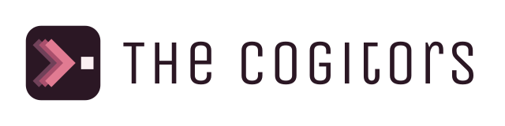

# The Cogitors

> "The eyes of common perception do not see far. Too often we make the most important decisions based only on superficial information."
>
> — Cogitor Kwyna

<p align="center">
  <picture>
    <source media="(prefers-color-scheme: dark)" srcset="assets/logo-dark.svg">
    
  </picture>
</p>

<p align="center">
  <a href="LICENSE"></a>
  <a href="https://milowda.com"></a>
  <a href="https://github.com/erayendes/cogitors/actions/workflows/ci.yml"></a>
  <a href="https://www.npmjs.com/package/cogitors"></a>
  
  
  <a href="https://agentskills.io"></a>
</p>

🇹🇷 [Türkçe](docs/README.tr.md)

---

When a critical architecture choice, security review or product decision is on the line, consulting a single AI is risky: a model cannot see its own hallucinations, biases and blind spots, and **it can defend flawed assumptions with complete confidence.**

**The Cogitors** brings three major model families — **Codex (OpenAI)**, **Claude (Anthropic)** and **Antigravity (Google)** — to one deliberation table.
Every model receives the whole task. Over four rounds they analyze independently, read each other's views and answer objections with evidence. In round five the Elder synthesizes one reasoned decision.

> **Core principle:** Consensus is not proof of correctness.
> Reasoned minority views and uncertainties are never suppressed; they are preserved in the final decision.

---

## Four Skills, Two Levels

| Invocation | Behavior |
|---|---|
| `/codex <task>` | Codex only. |
| `/claude <task>` | Claude Code only. |
| `/antigravity <task>` | Antigravity only. |
| `/cogitors <task>` | All three agents run the five-round deliberation protocol together. |

These are not new terminal commands but skill invocations following the **Agent Skills** standard. The agent that starts the session becomes the Elder, runs it **and takes part in the deliberation itself**; no extra fourth model is launched.

---

## Five-Round Protocol

```text
               ┌───────────────────────┐
               │   /cogitors <task>    │
               └───────────┬───────────┘
Round 1: Initial Analysis  ▼
────────────────────────────────────────────────────────
  ┌─────────────┐   ┌─────────────┐   ┌─────────────┐
  │    Codex    │   │ Antigravity │   │   Claude    │
  └─────────────┘   └─────────────┘   └─────────────┘
───────────────────────────┬────────────────────────────
                           ▼
               ┌───────────────────────┐
               │    Drafts Unsealed    │
               └───────────┬───────────┘
Round 2: Reconsideration   ▼
────────────────────────────────────────────────────────
  ┌─────────────┐   ┌─────────────┐   ┌─────────────┐
  │    Codex    │   │ Antigravity │   │   Claude    │
  └─────────────┘   └─────────────┘   └─────────────┘
───────────────────────────┬────────────────────────────
Round 3: Debate            ▼
────────────────────────────────────────────────────────
  ┌─────────────┐   ┌─────────────┐   ┌─────────────┐
  │    Codex    │─x─│ Antigravity │─x─│   Claude    │
  └─────────────┘   └─────────────┘   └─────────────┘
───────────────────────────┬────────────────────────────
Round 4: Final Position    ▼
────────────────────────────────────────────────────────
  ┌─────────────┐   ┌─────────────┐   ┌─────────────┐
  │    Codex    │   │ Antigravity │   │   Claude    │
  └─────────────┘   └─────────────┘   └─────────────┘
───────────────────────────┐
Round 5: Synthesis         ▼
────────────────────┬──────────────┐
                    │    Elder     │
                    └──────────────┘
```

1. **Initial Analysis:** All three agents analyze the same task and source files. In this round none of them sees the others' work.
2. **Reconsideration:** Agents read their peers' first-round views and revise their own initial analysis in light of them, or keep it.
3. **Debate:** Each agent defends its view with concrete evidence and objects to other views where it disagrees.
4. **Final Position:** Objections are answered and each agent sets its final stance.
5. **Synthesis:** The Elder combines all rounds and final corrections into one output with the agreements, the dissenting minority views and the uncertainties.

---

## Decision Outputs and Directory Layout

Every session is saved under your project's `docs/cogitors-decisions/` directory:

```text
<project-root>
  docs/cogitors-decisions/20260926-175500-mimir-ui-simplification/
  ├── antigravity-mimir-ui-simplification.md
  ├── brief-mimir-ui-simplification.md
  ├── claude-mimir-ui-simplification.md
  ├── codex-mimir-ui-simplification.md
  ├── decision-mimir-ui-simplification.md
  └── decisions-mimir-ui-simplification.html
```

* **Search Friendly:** Typing `decision` or `mimir codex` takes you straight to the right session and file.
* **Interactive HTML Report:** `decisions-*.html` is a single-file decision panel with no external libraries. The **Summary** tab holds the council table (per-round time and CLI-reported tokens), the Decisions (Consensus, Reasoned Dissent, Uncertainties) and P0/P1/P2 Actions; the **Matrix** tab shows each Cogitor's stance round by round; each Cogitor's own tab holds the full text of all four rounds. Tokens are never estimated: if a CLI did not report them, they are not shown.
* **Lazy Creation:** Cancelled or unstarted sessions leave no empty folders behind; the directory is created the moment the first output is written.
* **Language Preservation & Multilingual Templates:** Whatever language your task or source file is in (Turkish, English, etc.), prompt guides adapt automatically and all agents and the final report use that language.
* **Evidence File:** `--evidence-file report.txt` gives the test/lint output you ran yourself to every advisor from Round 1; it is hashed, and Cogitors never runs commands. It is not redacted.

> [!WARNING]
> Remove any secrets from your evidence file first.

* **Git Integration:** The `--git-diff` or `--git-staged` flags automatically snapshot working-tree or staged changes.
* **Elder Model:** The runner cannot know the Elder's model. The host reports it with `--chair-model`; the report marks it as self-reported.
* **Next Step:** `status.next_action` gives the one safe command for the current state, or the choices to put to the user. It never repeats a call whose outcome is unknown.

---

## Installation and Diagnostics

### Quick Install

```sh
npx skills add erayendes/cogitors
```

Install all four skills; `/codex`, `/claude` and `/antigravity` use the `cogitors` engine.

### Model Discovery and Interactive Selection ([Heimdall](https://github.com/erayendes/app-store-connect-mcp) Style)
No more wrestling with complex JSON:

1. **List Installed Models:**
   ```sh
   python3 skills/cogitors/scripts/cogitor.py models
   ```
   Lists the installed CLIs (`codex`, `claude`, `agy`) and all available models (including the dynamic `agy models` list).

2. **Interactive Model Picker (Heimdall):**
   ```sh
   python3 skills/cogitors/scripts/cogitor.py configure -i
   ```
   A numbered terminal menu lets you choose the model and reasoning effort for Codex, Claude and Antigravity, and saves them to `~/.cogitors/config.json` as your default profile. Every later session uses these preferences automatically.

3. **Direct CLI Flags:**
   ```sh
   python3 skills/cogitors/scripts/cogitor.py init /path/brief.md --chair antigravity --cwd "$PWD" \
     --codex-model o3 --codex-effort high \
     --claude-model sonnet
   ```

### Session Header Banner
Every `init` shows a header banner in the terminal and chat that summarizes the Elder, topic, council members, their models and the working directory. You can call it again at any time:

```sh
python3 skills/cogitors/scripts/cogitor.py banner /path/run [--markdown]
```

### Diagnostics (Doctor)
To confirm every CLI is installed, signed in and ready for a council session:

```sh
python3 skills/cogitors/scripts/cogitor.py doctor
```

### Requirements
* Python 3.9+ (macOS or Linux). **No external pip dependencies.**
* The `codex`, `claude` and `agy` CLIs installed and signed in (two agents are enough for a two-member council).

### npm
The engine is also published on npm as a thin launcher (Python 3.9+ is still required):

```sh
npx cogitors doctor
```

Every subcommand works the same way, e.g. `npx cogitors models`. Set `COGITORS_PYTHON` to use a different Python.

### Build
To build the four standalone skill packages:

```sh
PYTHONDONTWRITEBYTECODE=1 python3 scripts/package_skills.py --output dist
```

This produces 4 installable folders (`cogitors`, `codex`, `claude`, `antigravity`) under `dist/` and a `.skill` zip archive for each.

### Installation Paths
Copy the built folders into your agent's skill directory:

| Agent / Host | Skill Directory |
|---|---|
| Claude Code | `~/.claude/skills/` |
| Codex | `~/.codex/skills/` |
| Antigravity | `~/.gemini/config/skills/` |
| Agent Skills Standard | `~/.agents/skills/` |

---

## Usage Examples

> - `/cogitors` Review this architecture proposal together. Do not change any code, and state unresolved objections explicitly.
> - `/cogitors` `--git-diff HEAD~1` Deliberate on this PR's changes for security and performance.
> - `/codex` List the weaknesses in the authentication flow without changing code.
> - `/claude` Analyze the performance bottlenecks in this PR diff.
> - `/antigravity` Find the contradicting clauses in this technical spec.

---

## Limits, Cost and Safety

* **Bounded Cost:** A full session makes **8 initial external CLI calls** (2 advisors × 4 rounds); approved `extend-timeout` retries add at most 2 per round. Before dispatch, `status.scope` shows the providers, file/byte counts and maximum calls; the user approves once (`approve`). The Elder works inside its own session. There are no infinite loops, hidden retries or silent switches to another model provider.
* **Source Safety:** Deliberation grants no permission to edit source code. Source files are hash-checked between rounds; if a source changes, the session stops.
* **Honest Failures:** If an advisor fails, the user is asked (`continue-partial` or `stop`). A session never continues with fewer than 2 participants.
* **Time Limits:** 180 seconds per call by default and 1800 seconds for the whole session (adjustable with `--timeout` and `--total-timeout`).
* **Single-Step Orchestration:** The per-round `cycle` command records, dispatches and advances safely in one step.

---

## Tests

The whole flow is tested in a local simulated environment without calling any model:

```sh
PYTHONDONTWRITEBYTECODE=1 python3 -m unittest discover -s tests -v
```

The 61-test suite verifies the five-round data flow, Elder independence gates, slug generation, process cancellation, doctor diagnostics, the two-member council, the HTML decision viewer and packaging.

## The Story Behind the Name

**Cogitors** are ancient minds in the Dune universe that left their bodies behind and, preserved in a protective fluid, **devote thousands of years to thought**.
They reach a conclusion only after thinking and debating at length, never in haste.
This project takes its name from them: several models think through the same question without haste, questioning themselves and each other.

---

## License

[MIT](LICENSE) © [Eray Endes](https://github.com/erayendes)

---

<p align="center">
  <a href="https://github.com/erayendes/cogitors/issues/new?template=bug_report.yml">Report a bug</a> ·
  <a href="https://github.com/erayendes/cogitors/issues/new?template=feature_request.yml">Request a feature</a> ·
  <a href=".github/SUPPORT.md">Support</a> ·
  <a href=".github/SECURITY.md">Security</a> ·
  <a href=".github/CONTRIBUTING.md">Contributing</a>
</p>
